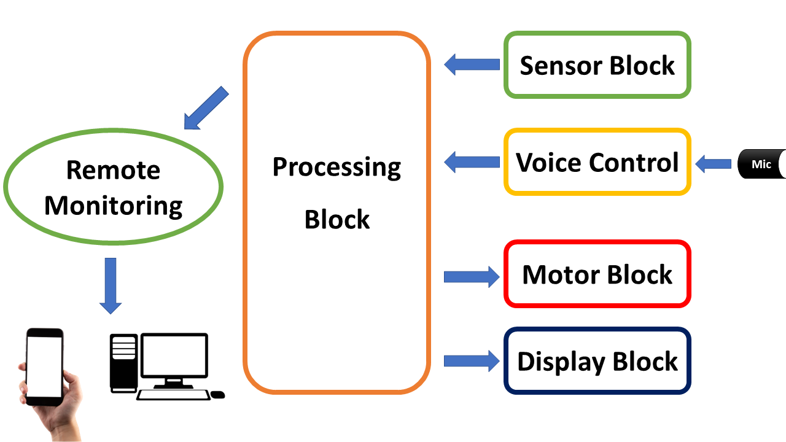

# SMART HOSPITAL BED MODEL USING ESP32 COMBINED IOT BLYNK

## OVERVIEW
Hello! This is a ***hands-on guide*** to help you build your own ***Smart Hospital Bed Model using ESP32 and Blynk IoT.***

The system architecture and its planned functionalities are outlined below:
* **Sensor Block (Inputs):** Collects vitals, bed position, and emergency signals.
* **Voice Control (Inputs):** Enables hands-free bed adjustments via a **Mic** module.
* **Motor Block (Outputs):** Controls the physical movement and positioning of the bed.
* **Display Block (Outputs):** Provides a local visual readout of system status.
* **Processing Block:** The "brain" (ESP32) that coordinates all system operations.
* **Remote Monitoring:** Syncs data to **Blynk Server** for tracking on smartphones/PCs.
<p align="center">
  
  <br>
</p>

## FEATURES
* **Smart Sensor Integration:** Real-time tracking of vitals using **MAX30100 (Heart Rate & SpO2)** and environmental data.
* **Offline Voice Command:** Hands-free bed control via **DFRobot Offline Voice Recognition**, no internet required for local actions.
* **Dual Monitoring System:** Visual feedback on a local **OLED display** and remote data sync via **Blynk IoT**.
* **Robust Hardware Design:** Custom-designed schematic optimized for **ESP32** to ensure stability and safety.
* **Smart Connectivity:** Seamless Wi-Fi integration with the **Blynk Server** for instant mobile notifications and control.
* **Fault-Tolerant System:** Designed with built-in logic to handle common hardware errors and connection drops effectively.

## COMPONENTS USED
| Component | Function |
| --- | --- |
| **ESP8266 NodeMCU** | Main MCU for data processing & Wi-Fi communication. |
| **0.91" I2C OLED** | Real-time visual interface for sensor data. |
| **DHT11 Sensor** | Monitors ambient temperature and humidity. |
| **MQ-135 Sensor** | Detects hazardous gases and measures air quality. |
| **Misc. Electronics** | Resistors, buttons, and LEDs for circuit interfacing. |

## REQUIRED LIBRARIES
Install these via **Library Manager** (`Ctrl + Shift + I`):
* **Blynk** (by Volodmpyr Shymanskyy)
* **DHT sensor library** & **Adafruit Unified Sensor** (by Adafruit)
* **MQ135** (by Georg Krocker)
* **Adafruit SSD1306** & **Adafruit GFX Library** (by Adafruit)

## WIRING DIAGRAM

| Component | Pin on ESP8266 | Function |
| --- | --- | --- |
| **OLED (SDA)** | **D2** | I2C Data |
| **OLED (SCL)** | **D1** | I2C Clock |
| **DHT11 Sensor** | **D5** | Temperature & Humidity Data |
| **MQ-135 Sensor** | **A0** | Analog Gas Signal |
| **Push Button** | **D4** | Display Toggle |
| **Warning LED** | **D3** | Pollution Alert |

*Note: Ensure your ESP8266 board is powered via USB or a stable 5V source.*
<p align="center">
  
  <br>
</p>

## CONFIGURATION AND CODE UPLOADING

Update your Blynk Template ID, Name, and Auth Token in the code section below.
```cpp
//Paste your Blynk config here
#define BLYNK_TEMPLATE_ID "...."
#define BLYNK_TEMPLATE_NAME "SENSOR NODE1"
#define BLYNK_AUTH_TOKEN "....."
```
*Note: Please refer to the documentation in docs for detailed Blynk setup instructions.*

Enter your Wi-Fi SSID and Password in the code section below.
```cpp
char ssid[] = "type here";  // type your wifi name
char pass[] = "type here";  // type your wifi password
```

### Code Uploading Guide
1. **Connect board to your PC via USB**
2. Open the **Arduino IDE**
3. Select **your correct board** under **Tools → Board**
4. Open **Tools → Port** and select the correct COM port
5. Click the **Upload** button
6. Open the **Serial Monitor** (baud rate: `115200`) to check the logs

## VIDEO PERFORMANCE
[](https://www.youtube.com/watch?v=SAjFOtDFIkM)

### 🚀 Enjoy your Air Quality System!
Thanks for checking out my project! If it helps you breathe easier (or just pass your graduation), my job here is done. Feel free to contribute, report issues, or give it a ⭐ if you liked it! 😊
